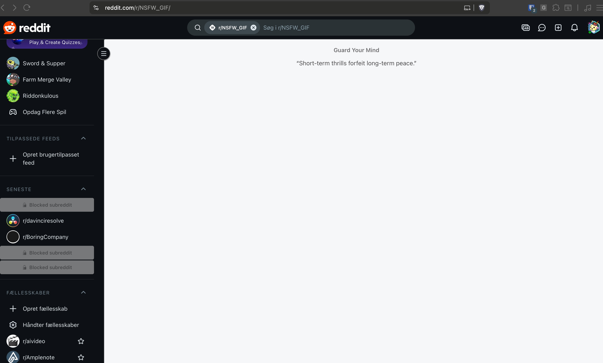

# Guard Your Mind

Guard Your Mind is a Chromium extension that blanks explicit Reddit posts, comments, and sidebars while letting you browse safely. Choose how blocked content should appear (blur, placeholder, quotes, or removal) and keep your preferences synced across sessions.

## Features

- Detects and neutralizes NSFW content across Reddit feeds and sidebars.
- Offers multiple blocking styles and a toggleable counter via the popup UI.
- Persists custom settings and manually blocked subreddit lists in Chrome storage.
- Ships with a built-in list of always-blocked domains for extra coverage.

## Screenshots





## Getting Started

### Prerequisites

- Node.js 18+ and npm.

### Install dependencies

```bash
npm install
```

### Run in development

```bash
npm run dev
```

This starts Vite in watch mode and rebuilds the extension as you edit files.

### Build for production

```bash
npm run build
```

The production-ready assets land in `dist/`, and the manifest is auto-adjusted by `scripts/fix-manifest.js`.

### Preview the popup bundle

```bash
npm run preview
```

Use this to spot-check the popup UI without loading the full extension.

### Lint and format

```bash
npm run lint
npm run format
```

Use the `:fix` variants (`npm run lint:fix`, `npm run format:fix`) to apply safe autofixes.

## Load the Extension in Chrome

1. Run `npm run build`.
2. Open `chrome://extensions` in your Chromium-based browser.
3. Enable **Developer mode** (top-right toggle).
4. Click **Load unpacked** and choose the `dist/` directory.

## Releases

Tagging the repo (e.g., `git tag v0.1.0 && git push origin v0.1.0`) automatically triggers the release workflow in `.github/workflows/release.yml`, which builds the extension, packages `dist/`, and uploads a versioned zip to the GitHub release page.

## License

This project is licensed under the [ISC License](LICENSE).
